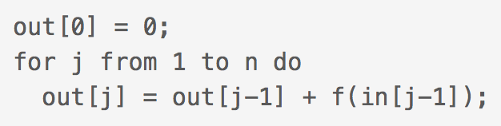
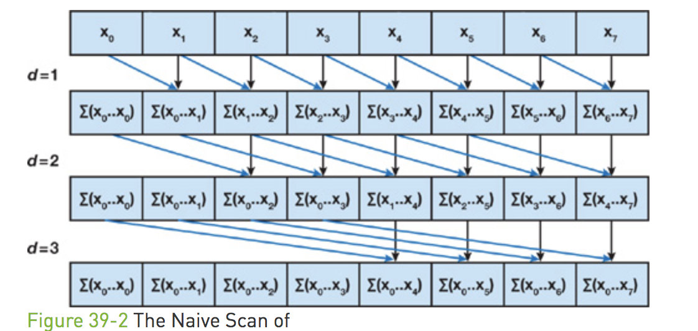
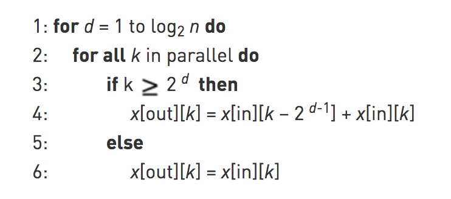
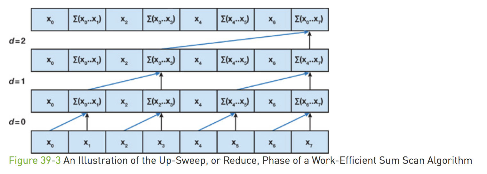
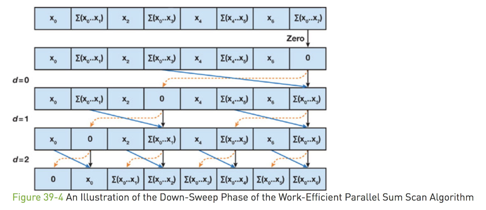
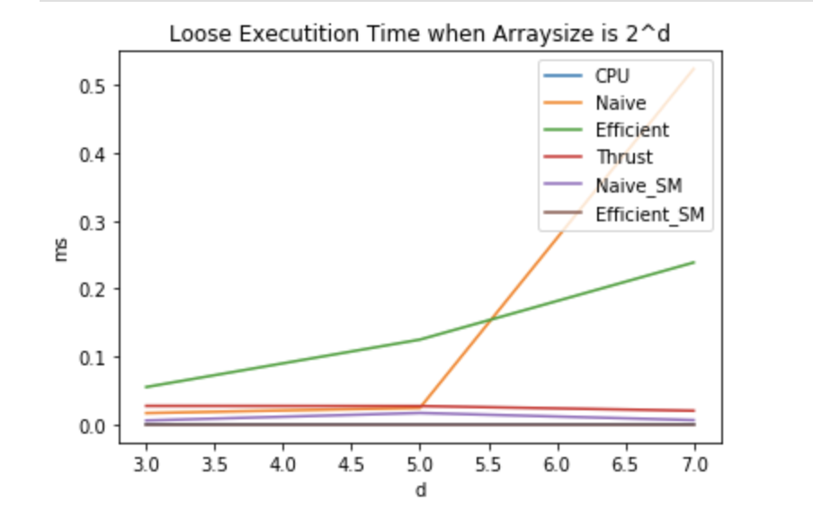
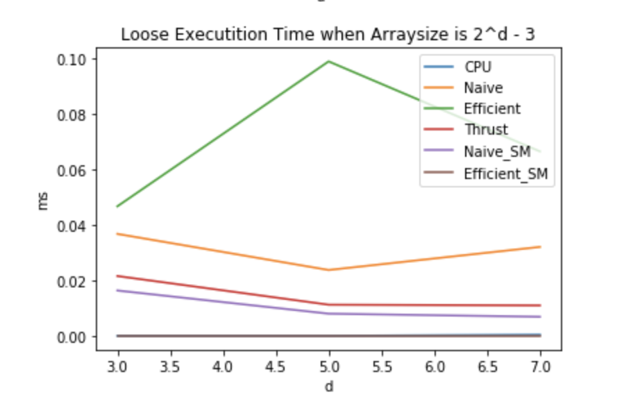

CUDA Stream Compaction
======================

**University of Pennsylvania, CIS 565: GPU Programming and Architecture, Project 2**

* Yu Sun 
* [LinkedIn](https://www.linkedin.com/in/yusun3/)
* Tested on: Tested on: Windows 10 , i7-6700HQ CPU @ 2.60GHz × 8 , GeForce GTX 960M/PCIe/SSE2, 7.7GB Memory (Personal Laptop)

## Introduction

In this project, stream compaction is implemented using the traditional CPU approach, a naive CUDA based scan algorithm and a more efficient algorithm that performs the scan in place. This project can be used as a base work for many useful things like path tracer. 

Stream compaction usually includes two processes: scan followed by compaction. 
For example, given an array and some condition, we create an boolean array indicating whether the conditions is met, and perform a exclusive scan on it, resulting in
a result that stores the indices where the condition is met in the original array. 

Below is a visualization of how scan and compaction works:


For CPU implementation, scan is basically just an for loop iterating through all the elements and produce the outputs.


For the naive GPU implementation, scan is done using two ping-pong buffers since the algorithm requires inplace updates of the array.



For the efficient GPU implementation, scan is done smartly using up-sweep and down-sweep, which reduces the amount of computation significantly. 


I tried to optimize the efficient algorithm by launching with different grid dimension that is best for each iteration, but in the end it's still slower than naive implementation when not using shared memory.

For performance comparison, the built-in scan algorithm from thrust library is also used.

I also implement the algorithm with shared memory instead of calling for loops from the host to see if it can speed up computations.


## Performance Analysis @ BlockSize = 128
The performance of these three different algorithms with or w/o shared memory are shown in the diagram below.



As can be seen from the diagram, when the array size is small, there is not much performance gain by using the GPU. Also, it is very interesting to note that
the efficient scan algorithm is not actually performing better than the naive algorithm when not utilizing shared memory. 

My reasoning behind the first phenomenon is that essentially when the array size if small, we do not gain many parallelsim by using the algorithm. The memory read from global 
memory is so heavy and we don't have enough parallelsim to hide this fact. It is not very obvious from my plot but from reasoning and looking at the performance from efficient shared memory, I would predict that as size of the array grows, the memory latency will hidden by the parallel computation so the GPU implementation will be faster. 

The second phenomenon shows that if not carefully designed, a smarter algorithm could actually perform less well. There are a lot of branches and idling threads in the algorithm that the block computation power is not fully used at all! Even if I tried to eliminate the idling threads by changing the grid dimension it's still slower than the naive algorithm. Changing the algorithm by using stride can resolve this issue since the threads will be accessing consecutive memory addresses. But I don't have enough time to implement them.

Also, as it can be seen, implementation with shared memory generally perform better than the one without shared memory. This is because the algorithm reused the computation quite often and by using shared memory, we can improve the performance by having to do many global reads. However, one needs to be careful to not deplet the resources on GPU. For example, my current algorithm wouldn't work if I have an array size that's bigger than the blockSize.


## Output from test Program

```
****************
  ** SCAN TESTS **
****************
    [   2  32  25  35   9  44  38  24   8   2  35   4  24 ...  30   0 ]
==== cpu scan, power-of-two ====
   elapsed time: 0.000395ms    (std::chrono Measured)
    [   0   2  34  59  94 103 147 185 209 217 219 254 258 ... 694 724 ]
==== cpu scan, non-power-of-two ====
   elapsed time: 0ms    (std::chrono Measured)
    [   0   2  34  59  94 103 147 185 209 217 219 254 258 ... 609 636 ]
    passed
==== naive scan, power-of-two ====
   elapsed time: 0.02448ms    (CUDA Measured)
    passed
==== naive scan, non-power-of-two ====
   elapsed time: 0.023744ms    (CUDA Measured)
    passed
==== work-efficient scan, power-of-two ====
   elapsed time: 0.125024ms    (CUDA Measured)
    [   0   2  34  59  94 103 147 185 209 217 219 254 258 ... 694 724 ]
    passed
==== work-efficient scan, non-power-of-two ====
   elapsed time: 0.098976ms    (CUDA Measured)
    passed
==== thrust scan, power-of-two ====
   elapsed time: 0.0272ms    (CUDA Measured)
    passed
==== thrust scan, non-power-of-two ====
   elapsed time: 0.011232ms    (CUDA Measured)
    passed
==== naive scan with shared memory, power of two ====
   elapsed time: 0.01696ms    (CUDA Measured)
    passed
==== naive scan with shared memory, non-power-of-two ====
   elapsed time: 0.008ms    (CUDA Measured)
    passed
==== efficient scan with shared memory, power of two ====
   elapsed time: 0ms    (CUDA Measured)
    passed
==== efficient scan with shared memory, non-power-of-two ====
   elapsed time: 0ms    (CUDA Measured)
    passed

*****************************
** STREAM COMPACTION TESTS **
*****************************
    [   1   1   1   3   1   3   3   1   1   2   3   1   1 ...   3   0 ]
==== cpu compact without scan, power-of-two ====
   elapsed time: 0ms    (std::chrono Measured)
    [   1   1   1   3   1   3   3   1   1   2   3   1   1 ...   1   3 ]
    passed
==== cpu compact without scan, non-power-of-two ====
   elapsed time: 0ms    (std::chrono Measured)
    [   1   1   1   3   1   3   3   1   1   2   3   1   1 ...   3   1 ]
    passed
==== cpu compact with scan ====
   elapsed time: 0.000791ms    (std::chrono Measured)
    [   1   1   1   3   1   3   3   1   1   2   3   1   1 ...   1   3 ]
    passed
==== work-efficient compact, power-of-two ====
   elapsed time: 2.36675ms    (CUDA Measured)
    passed
==== work-efficient compact, non-power-of-two ====
   elapsed time: 1.8215ms    (CUDA Measured)
    [   1   1   1   3   1   3   3   1   1   2   3   1   1 ...   3   1 ]
    passed
Press any key to continue . . .
```

